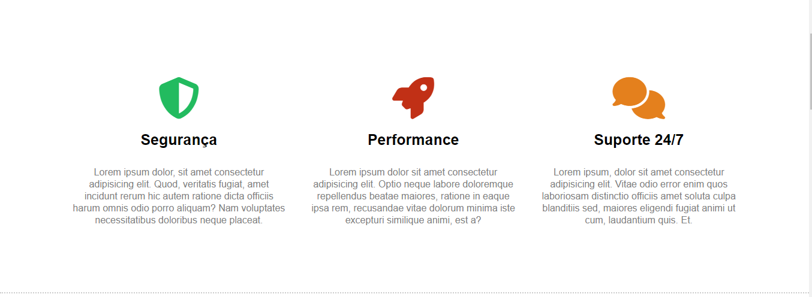
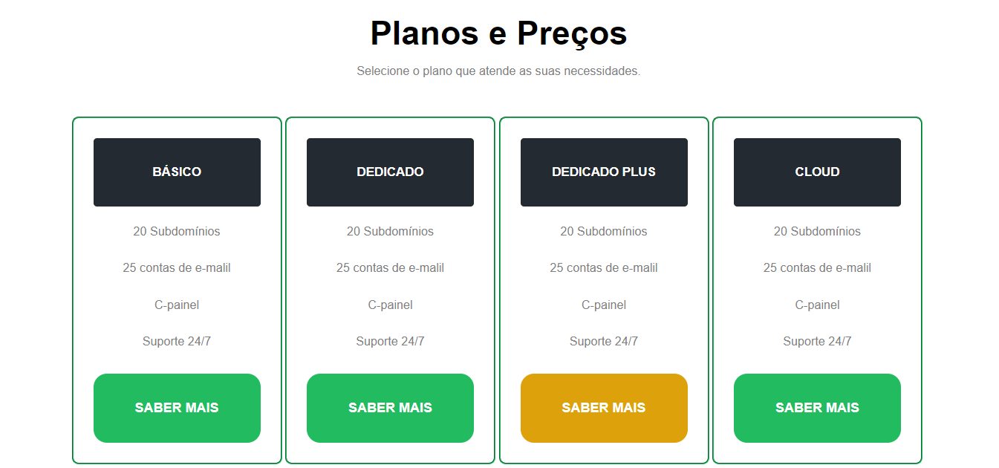
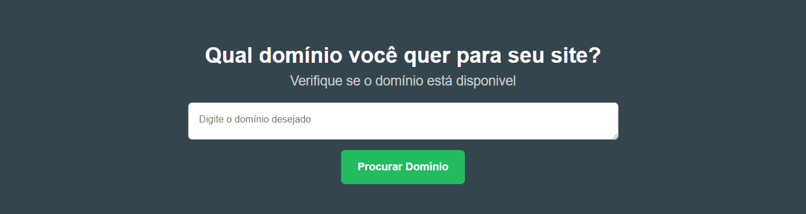

# Vav Host - Serviço de Hospedagem de sites.

Projeto criado em fevereiro/2024 para praticar conhecimentos em HTML e CSS em conjunto com o curso de Front-End do professor Matheus Battisti.

## Primeira tela:

## Segunda tela:

## Terceira tela:

## Quarta tela:

## Quinta tela:
! [Alt_Text](print.img/img5.png)

## Tecnologias usadas no projeto:

 - HTML5
 - CSS3
